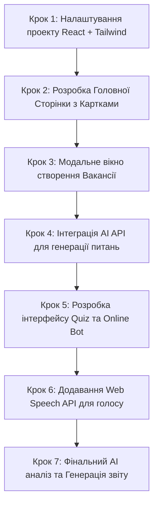

# 🚀 AI Interview Simulator — Technical Specification & Project Plan

## 📌 Executive Summary
**AI Interview Simulator** — це інноваційна платформа для проведення автоматизованих технічних співбесід за допомогою штучного інтелекту. Проєкт дозволяє кандидатам проходити випробування у двох форматах (Quiz та Online Bot з голосовим вводом/аналізом), а також дає можливість створювати власні кастомні вакансії з генерацією питань через AI API.

---

## 🛠 Tech Stack (Етап 1)

* **Frontend:** React.js (Vite / Next.js SPA)
* **Styling:** Tailwind CSS / Modern Dark Cyberpunk-Modern Theme
* **Icons & UI Components:** Lucide React, Radix UI / Shadcn UI (Headless components)
* **State Management:** React Context API / Zustand
* **Voice Recognition:** Web Speech API (`SpeechRecognition`)
* **AI Integration:** OpenAI API / Anthropic Claude API (generates questions & analyzes text/audio responses)
* **Database (Майбутній етап):** PostgreSQL

---

## 🎨 Design System & Visual Guidelines

### 🎨 Color Palette
* **Background:** Dark Slate (`#0F172A`) & Deep Navy (`#020617`)
* **Card / Surface:** Glassmorphism Dark (`#1E293B` з напівпрозорістю та `backdrop-blur`)
* **Primary Accent:** Electric Indigo (`#6366F1`) & Neon Cyan (`#06B6D4`)
* **Secondary Accent:** Soft Emerald (`#10B981`)
* **Text Primary:** Pure White (`#F8FAFC`)
* **Text Muted:** Slate Grey (`#94A3B8`)

### ✒️ Typography & UI Elements
* **Font:** Inter / Plus Jakarta Sans
* **Buttons:** Rounded Pill (`rounded-xl`), Subtle Gradient Glow on Hover
* **Modals:** Smooth backdrop overlays, animated entrances (`framer-motion`)

---

## 📋 Detailed Feature Specifications

### 1. Main Landing / Vacancies Page (`/vacancies`)
* **Header:** Логотип платформи, коротка інструкція, перемикач теми/мови.
* **Vacancy Grid:** Картки з готовими статичними вакансіями (наприклад: *Frontend React Developer*, *Fullstack Laravel + React*, *Senior Node.js Engineer*).
  * Кожна картка містить: Назву, рівень (Junior/Middle/Senior), теги скілів, короткий опис, кнопку **"Пройти співбесіду"**.
* **Primary CTA:** Велика виділена кнопка внизу сторінки: **"➕ Створити власну вакансію"**.

---

### 2. Custom Vacancy Creation Modal (Step 1)
При кліку на **"Створити власну вакансію"** відкривається модальне вікно з наступними полями:
1. **Назва вакансії** (*Input Text*, напр.: *Fullstack Developer*)
2. **Рівень (Seniority Level)** (*Select / Radio Buttons*):
   * 🟢 Junior
   * 🟡 Middle
   * 🔴 Senior
3. **Необхідні скіли (Tech Stack)** (*Multi-select Select*):
   * Набір популярних технологій: `React`, `Angular`, `Vue`, `TypeScript`, `Node.js`, `Laravel`, `Python`, `PostgreSQL`, `Docker` тощо.

---

### 3. Interview Configuration Modal (Step 2)
Після натискання "Далі" відкривається друга частина конфігуратора:
1. **Тип співбесіди (Radio Buttons / Cards):**
   * 🎯 **Quiz (Тести)** — питання з 4 варіантами відповідей.
   * 🤖 **Online Bot** — питання у вільній формі з можливістю введення текстом або **проговоренням голосом**.
2. **Кількість питань** (*Number Input / Slider*, за замовчуванням: 5-20).
3. **Опція "Онлайн кодинг" (Online Coding)** (*Checkbox/Toggle*):
   * Якщо увімкнено, додається секція з написанням коду в розширеному текстовому редакторі / IDE.
4. **Кнопка "🚀 Розпочати співбесіду"**:
   * При натисканні відправляється запит до AI API для генерації кастомного набору питань на основі вибраного стеку та рівня.

---

### 4. Interview Execution Engine (Проходження інтерв'ю)

#### 🅰️ Варіант A: Quiz (Тестування)
* Фіксований або згенерований список із 20 питань.
* Тaймер на відповідь (опціонально).
* Індикатор прогресу (напр. *Питання 4 з 20*).
* Варіанти відповідей у вигляді радіо-кнопок / карток з реакцією на клік.

#### 🅱️ Варіант B: Online Bot (Голосовий / Текстовий інтеракт)
* Бот зачитує/виводить питання.
* Інпут-поле для детальної відповіді.
* **🎤 Голосовий ввід:** Кнопка мікрофона (Web Speech API) для перетворення мови в текст.
* **AI Real-time Feedback:** Після відправки відповіді AI аналізує повноту, точність і глибину розуміння.

#### 🔤 Додатково: Секція Онлайн-Кодингу (Online Coding)
* Спеціальне поле для написання коду з підсвіткою синтаксису.
* Завдання на алгоритми / рефакторинг відповідно до стеку.

---

### 5. Post-Interview Analytics & AI Summary (Загальний аналіз)
Після завершення всіх питань AI аналізує всі відповіді та генерує детальний звіт:
* **Загальний балл (Score):** Наприклад, `85/100`.
* **Сильні сторони (Strengths):** Що кандидат знає добре.
* **Зони росту (Weaknesses / Gaps):** Що варто підтягнути.
* **Фідбек по кодингу/голосовим відповідям:** Рекомендації щодо покращення.

---

## 🚀 Step-by-Step Implementation Roadmap (Етап 1)

### 🗓 Деталізований план робіт:

#### **Тиждень 1: Базовий UI & Модалки**
- [ ] Ініціалізація React проєкту (Vite) + Tailwind CSS.
- [ ] Створення дизайн-системи (кольори, типи кнопок, модалки).
- [ ] Верстка сторінки вакансій з моковими даними.
- [ ] Верстка Модалки #1 (Створення вакансії: Скіли, Рівень).
- [ ] Верстка Модалки #2 (Конфігурація тесту: Quiz / Bot / Кількість питань / Coding toggle).

#### **Тиждень 2: Логіка опитування & AI Інтеграція**
- [ ] Підключення OpenAI / Claude API для генерації масиву питань за промптом.
- [ ] Розробка компонента **Quiz** (переключення питань, вибір варіантів, збереження відповідей).
- [ ] Розробка компонента **Online Bot** (текстовий інпут, надсилання відповіді в AI).
- [ ] Додавання модуля **Web Speech API** для розпізнавання голосу через мікрофон.

#### **Тиждень 3: Кодинг та Аналітика**
- [ ] Додавання секції **Online Coding** (просте вікно редагування коду).
- [ ] Створення екрану **AI Summary Report** (Загальний аналіз відповідей кандидату).
- [ ] Тестування повного циклу: Створення -> Проходження -> Звіт.

---

## 🔮 Майбутні етапи (Фаза 2+)
1. **Database Integration:** Підключення PostgreSQL (Prisma ORM / Supabase) для збереження користувачів, вакансій та результатів.
2. **Admin Panel:** Панель адміністратора для вручного додавання вакансій та перегляду кандидатів.
3. **User Authentication:** Авторизація (JWT / NextAuth) для кандидатів та рекрутерів.
